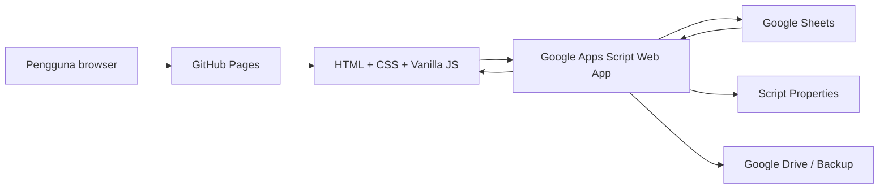

<!--
File Path: README.md
File Version: SPRAD v2.8-production | readme-docs.1
Update Info: 2026-06-20 - Tambah dokumentasi GitHub penuh untuk struktur, fungsi, deployment dan roadmap SPRAD.
-->

# SPRAD - Sistem Penilaian Risiko Audit Dalam


SPRAD ialah sistem penilaian risiko audit dalam untuk institusi, universiti dan organisasi yang mahu merekod, menyemak, menganalisis dan melaporkan isu audit secara tersusun. Sistem ini dibina untuk stack ringan: **GitHub Pages + HTML/CSS/JavaScript vanilla + Google Apps Script + Google Sheets**.

Reka bentuk UI semasa merujuk gaya repo **UjianMe**: light theme, sidebar kerja yang jelas, kad data yang kemas, font Plus Jakarta Sans, dan layout dashboard yang padat tetapi mudah dibaca.

---

## Versi Semasa

**Versi sistem:** `SPRAD v2.8-production`

**Schema frontend:** `2.8-production`

**Status fasa:** `Fasa 7 daripada 12`

**Status blueprint asal:** Fasa 0 hingga Fasa 6 sudah dilengkapkan dalam repo. Fasa 7 ialah lapisan tambahan untuk AI intake, production UI polish, confirmation popup dan metadata pemantauan fail.

Ringkasan semasa:

| Item | Status |
| --- | --- |
| Hosting frontend | GitHub Pages |
| Backend API | Google Apps Script Web App |
| Database | Google Sheets |
| Bahasa UI | Bahasa Melayu |
| Theme | Light theme, gaya UjianMe |
| Auth | Login/token session melalui Apps Script |
| Role | `super_admin`, `institution_admin`, `auditor`, `reviewer`, `viewer` |
| Data utama | Institusi, PTJ, audit cycles, audits, findings, corrective actions |
| Mutation POST | `mode:"no-cors"` + receipt polling |
| Dashboard | Summary risiko, kategori, status tindakan |
| Laporan | Print/CSV dataset |
| AI intake | Rangka frontend dan draft pipeline tersedia |

---

## Changelog

### v2.8-production (20 Jun 2026) - Production UI, dokumentasi dan monitoring

Perubahan utama:

- Nama sistem diseragamkan sebagai **Sistem Penilaian Risiko Audit Dalam (SPRAD)**.
- UI diseragamkan mengikut gaya UjianMe:
  - `Plus Jakarta Sans`.
  - Warna asas `#f8fafc`.
  - Accent biru `#2563eb`.
  - Sidebar kerja.
  - Kad statistik gaya admin dashboard.
  - Toast notification kanan atas.
- Font global dikecilkan:
  - Desktop/tablet: `14px`.
  - Mobile: `13.5px`.
- Side menu diasingkan daripada card kandungan:
  - Sidebar tidak lagi kelihatan seperti card.
  - Sidebar ada border kanan pada desktop.
  - Content utama dibalut dalam `.sprad-content`.
- Semua tindakan penting menggunakan confirmation popup.
- Semua fail tracked mempunyai metadata header:
  - `File Path`
  - `File Version`
  - `Update Info`
- README penuh ditambah untuk GitHub.

Fail penting:

- `brand.css`
- `assets/js/core/action-confirmation.js`
- `assets/js/components/app-shell.js`
- `assets/js/pages/*.js`
- `README.md`
- `tests/*.test.mjs`

### v2.7-ai-intake (20 Jun 2026) - AI intake dan semakan automatik

Perubahan utama:

- Halaman `ai-intake.html`.
- Service `assets/js/services/ai-intake-service.js`.
- Utility `assets/js/core/ai-intake-utils.js`.
- Rangka untuk upload/drag-and-drop dokumen.
- Draft penemuan audit daripada analisis dokumen.
- Validasi fail sebelum dihantar ke Apps Script.
- Laluan untuk promote draft AI kepada finding rasmi.

Nota:

- Integrasi Gemini sebenar masih bergantung kepada konfigurasi Apps Script dan secret di Properties.
- Fasa ini menyediakan struktur sistem supaya dokumen audit boleh diproses secara terkawal.

### v2.6-full-blueprint (20 Jun 2026) - Fasa 3 hingga Fasa 6

Perubahan utama:

- Audit cycles.
- Audit engagements.
- Findings.
- Corrective actions.
- Workflow submit, return, approve, override, verify.
- Dashboard summary.
- Report dataset.
- Audit logs.
- Mutation receipts.
- Password hash pepper + salt.
- Rate limit.
- Backup helper.

### v2.2-phase2 (20 Jun 2026) - Institusi dan data induk

Perubahan utama:

- CRUD institutions.
- CRUD org units/PTJ.
- CRUD users.
- CRUD risk categories.
- Risk matrix/risk levels.
- Institution scope.
- Role mapping daripada sistem lama.

### v2.1-foundation (20 Jun 2026) - Foundation

Perubahan utama:

- Modular JavaScript.
- `assets/js/config.js` sebagai pusat config.
- Router backend Apps Script.
- Response envelope.
- Migration/setup idempotent.
- Legacy compatibility untuk `contacts`, `users`, `sessions`.

---

## Gambaran Keseluruhan

SPRAD bukan lagi contact form biasa. Ia ialah sistem audit risk assessment berstruktur untuk organisasi berbilang institusi.

Hierarki data utama:

```text
SPRAD
└── Institusi / Universiti
    ├── Pengguna dan peranan
    ├── PTJ / Jabatan / Unit
    ├── Kitaran audit
    │   └── Audit engagement
    │       └── Penemuan / Isu audit
    │           ├── Kategori risiko
    │           ├── PTJ terlibat
    │           ├── Likelihood 1-4
    │           ├── Impact 1-4
    │           ├── Skor risiko 1-16
    │           ├── Tahap risiko
    │           ├── Justifikasi dan bukti
    │           ├── Syor audit
    │           └── Tindakan pembetulan
    ├── Dashboard dan analitik
    ├── Laporan rasmi
    └── Audit logs
```

Matlamat sistem:

- Membantu auditor merekod isu audit secara konsisten.
- Membantu reviewer/pentadbir menyemak dan meluluskan finding.
- Membantu pengurusan tertinggi melihat rumusan risiko.
- Membina asas untuk analisis dokumen menggunakan AI/Gemini.
- Kekal mudah deploy kerana hanya menggunakan GitHub Pages, Apps Script dan Google Sheets.

---

## Stack Teknologi

| Lapisan | Teknologi | Nota |
| --- | --- | --- |
| Frontend hosting | GitHub Pages | Static hosting untuk HTML/CSS/JS |
| Frontend UI | HTML, Tailwind browser CDN, CSS custom | Tiada framework frontend |
| JavaScript | Vanilla ES Modules | Kod dipecahkan kepada `assets/js/*` |
| Backend | Google Apps Script Web App | `doGet` untuk read, `doPost` untuk mutation |
| Database | Google Sheets | Semua sheet dicipta/diurus oleh `setup()` |
| Auth | Token session Apps Script | Token disimpan di `localStorage` |
| Mutation | POST `mode:"no-cors"` | Status disahkan melalui polling receipt |
| AI | Rangka Gemini melalui Apps Script | Fasa seterusnya perlu API key/Properties |
| Deployment | Git push ke GitHub Pages + redeploy Apps Script | Dua lapisan deploy |

Keputusan penting:

- Tidak menggunakan React, Vue, Laravel atau database server.
- Tidak menggunakan backend server selain Apps Script.
- Tidak memadam data lama secara agresif.
- Menyokong compatibility dengan `contacts` legacy.
- Mutasi data business menggunakan soft delete/archive.

---

## Senibina Sistem



### Frontend

Frontend ialah static app. Setiap halaman HTML memuatkan:

- Tailwind browser CDN.
- `brand.css`.
- Module JavaScript khusus halaman.
- Config global daripada `assets/js/config.js`.

Halaman menggunakan clean URL tanpa `.html` melalui:

- GitHub Pages fallback `404.html`.
- `normalizeCleanUrl(...)` di app shell.
- Link dalaman seperti `dashboard`, `form`, `reports`.

### Backend

Backend ialah satu fail utama:

```text
apps-script/Code.gs
```

Sebab masih satu fail:

- Mudah copy/paste ke Google Apps Script.
- Selari dengan permintaan stack ringan.
- Elak proses deploy Apps Script multi-file yang lebih rumit untuk pengguna bukan teknikal.

Backend menyediakan:

- Router GET.
- Router POST.
- Auth/session validation.
- Permission checks.
- Sheet repository helper.
- Risk engine.
- Mutation receipt service.
- Audit logging.
- Setup/migration idempotent.

### Database

Database ialah Google Sheets. `setup()` dalam Apps Script akan:

- Cipta sheet yang belum ada.
- Cipta header yang diperlukan.
- Tambah dummy data untuk testing.
- Simpan setting schema.
- Preserve data sedia ada.

---

## Ciri-ciri Utama

### 1. Authentication dan session

- Login melalui Apps Script GET.
- Token disimpan sebagai `token`.
- Logout memanggil `auth.logout`.
- Session lama/invalid akan redirect ke login.
- "Ingat saya" menyimpan username sahaja untuk production behavior yang lebih selamat.

### 2. Role dan access control

Peranan V2:

| Role | Skop | Fungsi utama |
| --- | --- | --- |
| `super_admin` | Semua institusi | Urus semua data, settings, users, laporan |
| `institution_admin` | Institusi sendiri | Urus PTJ, pengguna, audit cycle, kategori |
| `auditor` | Institusi sendiri | Cipta dan edit finding draf/returned |
| `reviewer` | Institusi sendiri | Review, approve, return, override, verify |
| `viewer` | Institusi sendiri | Lihat dashboard dan laporan |

Mapping legacy:

```text
pentadbir -> super_admin / institution_admin
pengguna  -> auditor
```

### 3. Data induk

Modul data induk:

- Institusi.
- PTJ / org units.
- Pengguna.
- Risk categories.
- Risk levels.
- Settings.

Semua modul data induk menggunakan:

- List.
- Search/filter.
- Pagination 5 rekod.
- Create/update/archive/restore.
- Confirmation popup.
- Receipt polling selepas mutation.

### 4. Audit operations

Modul audit:

- Audit cycles.
- Audits / engagement.
- Findings.
- Corrective actions.
- Audit logs.

Semua finding dikira semula di backend berdasarkan:

```text
risk_score = likelihood * impact
```

Tahap default:

| Skor | Tahap |
| --- | --- |
| 1-4 | Rendah |
| 5-8 | Sederhana |
| 9-12 | Tinggi |
| 13-16 | Kritikal |

### 5. Workflow review

Finding workflow:

```text
draft -> submitted -> approved
draft -> submitted -> returned
returned -> submitted
approved -> closed
```

Corrective action workflow:

```text
open -> in_progress -> awaiting_verification -> verified
awaiting_verification -> returned
verified -> closed
```

Override tahap risiko:

- Hanya role semakan dibenarkan.
- Sebab override wajib.
- Perubahan direkod dalam audit log.

### 6. Dashboard

Dashboard memaparkan:

- Jumlah penemuan.
- Tahap keseluruhan.
- Peratus tinggi/kritikal.
- Tindakan lewat.
- Taburan tahap risiko.
- Kategori risiko teratas.
- Item yang perlu perhatian.

Cache tempatan digunakan supaya reload seterusnya boleh memaparkan data lebih cepat sementara backend Google Sheets mengambil masa.

### 7. Reports

Laporan menyokong:

- Dataset laporan.
- Print browser.
- Export CSV.
- Ringkasan finding.
- Kategori.
- Status tindakan.

Matlamat jangka panjang ialah laporan rasmi seperti rujukan UniMAP:

- Matriks risiko.
- Isu mengikut kategori.
- Rumusan keseluruhan.
- Rumusan kategori.
- Keutamaan tindakan.

### 8. AI intake

AI intake ialah modul untuk aliran kerja masa depan:

1. Auditor upload dokumen laporan.
2. Apps Script/Gemini mengekstrak isu audit.
3. Sistem jadikan draft finding.
4. Auditor/reviewer semak.
5. Draft dipromote menjadi finding rasmi.

Status semasa:

- UI dan service tersedia.
- Validasi fail tersedia.
- Draft list tersedia.
- Integrasi Gemini sebenar perlu konfigurasi backend/secret.

### 9. Confirmation popup

Semua tindakan mutating dilindungi confirmation popup:

- Create.
- Update.
- Delete/archive.
- Restore.
- Submit.
- Approve.
- Return.
- Override.
- Verify.
- Promote AI draft.
- Register.
- Logout.

### 10. Metadata header fail

Semua fail tracked mempunyai metadata header untuk memudahkan pemantauan:

```text
File Path
File Version
Update Info
```

Untuk JSON, metadata disimpan dalam `_spradFileInfo` kerana JSON tidak menyokong comment.

---

## Struktur Fail

Struktur utama repo:

```text
/
  index.html
  login.html
  register.html
  form.html
  dashboard.html
  ai-intake.html
  audit-cycles.html
  audits.html
  findings.html
  corrective-actions.html
  reports.html
  audit-logs.html
  institutions.html
  org-units.html
  users.html
  settings.html
  system-health.html
  view.html
  404.html
  brand.css
  package.json
  README.md

  apps-script/
    Code.gs
    README.md
    appsscript.json

  assets/
    js/
      config.js
      components/
        app-shell.js
      core/
        action-confirmation.js
        ai-intake-utils.js
        api.js
        audit-workflow-utils.js
        bulk-finding-utils.js
        contact-utils.js
        data-master-utils.js
        formatters.js
        mutation.js
        mutation-utils.js
        permissions.js
        risk-engine.js
        storage.js
        system-health-utils.js
        validators.js
      pages/
        ai-intake-page.js
        audit-workspace-page.js
        dashboard-page.js
        data-master-page.js
        form-page.js
        reports-page.js
        system-health-page.js
      services/
        ai-intake-service.js
        audit-service.js
        data-master-service.js
        system-service.js

  docs/
    API_CONTRACT.md
    DATA_SCHEMA.md
    DEPLOYMENT.md
    MANUAL_TEST_CHECKLIST.md
    SPRAD_V2_SYSTEM_BLUEPRINT.md
    SPRAD_V2_PHASE1_IMPLEMENTATION.md
    SPRAD_V2_PHASE2_IMPLEMENTATION.md
    SPRAD_V2_PHASE3_TO_6_IMPLEMENTATION.md

  tests/
    *.test.mjs
```

Fail paling penting untuk kerja harian:

| Fail | Fungsi |
| --- | --- |
| `README.md` | Dokumentasi utama GitHub |
| `brand.css` | Theme global, layout, sidebar, card, typography |
| `assets/js/config.js` | Nama app, version, API URL, storage keys |
| `assets/js/components/app-shell.js` | Session guard, sidebar, logout, toast |
| `assets/js/core/api.js` | GET API helper dan logout |
| `assets/js/core/mutation.js` | POST `mode:"no-cors"` mutation |
| `assets/js/core/mutation-utils.js` | Polling mutation receipts |
| `assets/js/core/risk-engine.js` | Formula skor risiko |
| `apps-script/Code.gs` | Backend Apps Script penuh |
| `docs/SPRAD_V2_SYSTEM_BLUEPRINT.md` | Spesifikasi rasmi sistem |

---

## Struktur Google Sheets

### Legacy sheets

Sheet lama masih dikekalkan untuk compatibility:

| Sheet | Tujuan |
| --- | --- |
| `contacts` | Legacy contact/form submissions |
| `users` | Pengguna legacy + V2 |
| `sessions` | Token/session |
| `settings` | Config sistem dan schema version |

### V2 sheets

Sheet V2 yang digunakan:

| Sheet | Tujuan |
| --- | --- |
| `institutions` | Senarai institusi/universiti |
| `org_units` | PTJ, jabatan, unit |
| `audit_cycles` | Kitaran audit mengikut tahun/tempoh |
| `audits` | Audit engagement/skop audit |
| `risk_categories` | Kategori risiko |
| `likelihood_scale` | Skala kemungkinan 1-4 |
| `impact_scale` | Skala kesan 1-4 |
| `risk_levels` | Tahap risiko dan julat skor |
| `findings` | Penemuan/isu audit |
| `finding_units` | Hubungan many-to-many finding dan PTJ |
| `corrective_actions` | Tindakan pembetulan |
| `attachments` | URL lampiran/bukti |
| `audit_logs` | Log tindakan penting |
| `mutation_receipts` | Status mutation `no-cors` |
| `ai_jobs` | Job analisis dokumen AI |
| `ai_drafts` | Draft finding hasil AI |

### Prinsip data

- Semua data business perlu ada `institution_id`.
- Delete biasa ialah archive/soft delete.
- Restore disokong untuk data yang diarchive.
- Backend wajib semak role dan institution scope.
- Backend wajib kira semula skor risiko.
- Audit log tidak menyimpan password/token mentah.

---

## API Apps Script

Semua API berpusat pada URL dalam:

```text
assets/js/config.js
```

### GET

GET digunakan untuk response yang browser perlu baca.

Contoh:

```js
const params = new URLSearchParams({
  action: "dashboard.summary",
  token
});
const res = await fetch(URL + "?" + params.toString());
const data = await res.json();
```

GET actions penting:

| Action | Tujuan |
| --- | --- |
| `login` | Login pengguna |
| `register` | Register pengguna biasa |
| `auth.me` | Semak profil session |
| `auth.logout` | Revoke session |
| `config.get` | Config dan schema |
| `institutions.list` | List institusi |
| `orgUnits.list` | List PTJ/unit |
| `users.list` | List pengguna |
| `riskCategories.list` | List kategori risiko |
| `riskMatrix.get` | Matrix/tahap risiko |
| `auditCycles.list` | List audit cycles |
| `audits.list` | List audit engagements |
| `findings.list` | List findings |
| `correctiveActions.list` | List corrective actions |
| `auditLogs.list` | List audit logs |
| `dashboard.summary` | Data dashboard |
| `reports.dataset` | Dataset laporan |
| `aiJobs.list` | List AI jobs |
| `aiDrafts.list` | List AI drafts |
| `system.health` | Semakan health admin-only |
| `mutations.status` | Semak receipt mutation |

### POST

POST digunakan untuk mutation. Disebabkan Apps Script Web App tidak memberi CORS header lengkap untuk POST, frontend menggunakan `mode:"no-cors"`.

Format wajib:

```js
await fetch(URL, {
  method: "POST",
  mode: "no-cors",
  body: JSON.stringify(data)
});
```

Selepas POST, frontend akan poll:

```text
GET mutations.status?token=...&request_id=...
```

Mutation penting:

| Mutation | Tujuan |
| --- | --- |
| `institutions.create/update/delete/restore` | CRUD institusi |
| `orgUnits.create/update/delete/restore` | CRUD PTJ/unit |
| `users.create/update/delete/restore` | CRUD pengguna |
| `riskCategories.create/update/delete/restore` | CRUD kategori |
| `riskLevels.update` | Update tahap risiko |
| `auditCycles.create/update/delete/restore/finalize` | Kitaran audit |
| `audits.create/update/delete/restore` | Audit engagement |
| `findings.create/update/delete/restore/submit/approve/return/overrideLevel` | Finding |
| `correctiveActions.create/update/delete/restore/submitForVerification/verify/return` | Tindakan |
| `aiJobs.create` | Mulakan job intake dokumen |
| `aiDrafts.promote` | Promote draft AI kepada finding |
| `backup.now` | Backup manual |

---

## Peranan dan Akses

| Role | Akses utama | Had |
| --- | --- | --- |
| `super_admin` | Semua modul dan semua institusi | Perlu berhati-hati kerana skop global |
| `institution_admin` | Data institusi sendiri | Tidak boleh akses institusi lain |
| `auditor` | Cipta/edit finding draf dan returned | Tidak boleh approve |
| `reviewer` | Review, approve, return, verify, override | Tidak mengurus semua settings global |
| `viewer` | Dashboard dan laporan | Read-only |

Frontend menapis menu berdasarkan permission, tetapi backend tetap menjadi sumber kebenaran.

---

## Aliran Kerja Utama

### Aliran auditor

1. Login.
2. Buka `form` atau `findings`.
3. Cipta finding.
4. Pilih institusi, audit cycle, audit engagement, kategori dan PTJ.
5. Masukkan likelihood dan impact.
6. Sistem preview skor.
7. Backend kira semula skor rasmi.
8. Submit untuk semakan.

### Aliran reviewer

1. Login sebagai reviewer/pentadbir.
2. Buka `findings`.
3. Semak finding submitted.
4. Pilih approve atau return.
5. Jika override tahap risiko, masukkan sebab wajib.
6. Cipta atau semak corrective actions.
7. Verify tindakan apabila bukti mencukupi.

### Aliran pengurusan

1. Login.
2. Buka `dashboard`.
3. Lihat ringkasan risiko.
4. Buka `reports`.
5. Cetak atau export CSV.

### Aliran AI intake

1. Buka `ai-intake`.
2. Upload/drag-and-drop dokumen.
3. Sistem create job.
4. Draft finding dipaparkan.
5. Auditor semak dan promote draft.
6. Finding masuk workflow biasa.

---

## Setup dan Deployment

### 1. Frontend GitHub Pages

Repo:

```text
https://github.com/akmal4244/sprad
```

Live:

```text
https://akmal4244.github.io/sprad/
```

Deploy frontend:

```bash
git add -A
git commit -m "Update SPRAD"
git push origin main
```

GitHub Pages akan serve fail statik daripada branch `main`.

### 2. Backend Apps Script

Jika `apps-script/Code.gs` berubah:

1. Buka Google Apps Script project.
2. Backup kod semasa.
3. Salin semua kandungan `apps-script/Code.gs`.
4. Jika perlu, salin `apps-script/appsscript.json`.
5. Run function:

```text
setup()
```

6. Deploy semula Web App.
7. Test endpoint:

```text
config.get
```

Pastikan schema/version ialah:

```text
2.8-production
```

### 3. Google Sheets

Apps Script `setup()` akan automatik:

- Cipta sheet yang belum ada.
- Cipta header.
- Tambah dummy data asas.
- Preserve data sedia ada.
- Update settings.

Jangan padam sheet secara manual kecuali sudah backup.

### 4. Local development

Repo ini static, jadi boleh guna mana-mana local static server.

Contoh:

```bash
python -m http.server 8787
```

Buka:

```text
http://127.0.0.1:8787/
```

### 5. Test

```bash
npm test
```

Test menggunakan Node built-in test runner.

---

## Keselamatan

Lapisan keselamatan yang sudah ada:

- Role permission di frontend dan backend.
- Institution scope.
- Token session.
- Logout revoke session.
- Password hash pepper + salt untuk session baru/upgrade login.
- Rate limit login/submission.
- Soft delete dan audit log.
- Mutation receipt untuk elak false success.
- Confirmation popup untuk tindakan penting.
- Admin public registration ditutup.
- Metadata header untuk trace perubahan fail.

Peraturan penting:

- Jangan commit secret API key.
- Pepper/API key perlu disimpan di Apps Script Properties.
- Jangan simpan password dalam `localStorage`.
- Jangan hard delete data audit tanpa backup.
- Jangan bypass `setup()` selepas ubah backend schema.

Had stack:

- Google Sheets sesuai untuk sistem kecil/sederhana.
- Apps Script ada had quota dan latency.
- POST Apps Script guna `no-cors`, jadi response mutation tidak boleh dibaca terus.
- Receipt polling ialah workaround rasmi dalam sistem ini.

---

## Testing dan QA

Test automatik semasa merangkumi:

- Action confirmation.
- API helper.
- Mutation receipt.
- Risk engine.
- Permissions.
- Storage validators.
- Data master utils.
- Audit workflow utils.
- AI intake utils.
- CRUD contract frontend/backend.
- Metadata header.
- README documentation contract.
- UjianMe style contract.

Command:

```bash
npm test
```

Manual smoke test penting:

1. Login sebagai pentadbir.
2. Dashboard load tanpa console error.
3. Sidebar tampil sebagai panel berasingan.
4. CRUD institusi berfungsi.
5. CRUD PTJ berfungsi.
6. CRUD user berfungsi.
7. Create finding.
8. Submit finding.
9. Approve/return finding.
10. Create corrective action.
11. Verify corrective action.
12. Print/export report.
13. Logout membuang token.

---

## Roadmap Fasa Akan Datang

Status sekarang ialah **Fasa 7 daripada 12**.

### Fasa 8 - Production QA penuh

Perlu dibuat:

- Test semua CRUD satu per satu di live site.
- Test role `super_admin`, `institution_admin`, `auditor`, `reviewer`, `viewer`.
- Test tenant isolation antara institusi.
- Test mutation receipt pada network perlahan.
- Test pagination 5 rekod semua table.
- Test mobile dan desktop.
- Lengkapkan checklist UAT.

### Fasa 9 - AI dokumen sebenar

Perlu dibuat:

- Integrasi Gemini sebenar di Apps Script.
- Simpan Gemini API key dalam Script Properties.
- Parser PDF/Word/Excel atau upload URL Google Drive.
- AI extraction kepada struktur finding.
- Confidence score dan flag semakan.
- UI compare antara teks asal dan draft finding.

### Fasa 10 - Dashboard pengurusan tertinggi

Perlu dibuat:

- Filter lengkap institusi/tahun/PTJ/kategori/status.
- Chart risiko mengikut tahap.
- Chart risiko mengikut PTJ.
- Trend bulanan.
- Executive summary.
- Layout laporan lebih dekat dengan format UniMAP.

### Fasa 11 - Security dan governance production

Perlu dibuat:

- Audit permission endpoint demi endpoint.
- Review token expiry dan revoke policy.
- Backup automatik berkala.
- Log viewer yang lebih mudah ditapis.
- Export audit logs.
- Rate limit tuning.
- Dokumentasi incident/rollback.

### Fasa 12 - Packaging production

Perlu dibuat:

- Build CSS production tanpa Tailwind browser CDN.
- Minify static assets.
- Dokumentasi pengguna.
- Dokumentasi pentadbir.
- Video/manual ringkas operasi.
- Release tag GitHub.
- UAT sign-off.

---

## Dokumen Rujukan

| Dokumen | Tujuan |
| --- | --- |
| `docs/SPRAD_V2_SYSTEM_BLUEPRINT.md` | Blueprint penuh sistem |
| `docs/API_CONTRACT.md` | Kontrak API Apps Script |
| `docs/DATA_SCHEMA.md` | Struktur Google Sheets |
| `docs/DEPLOYMENT.md` | Nota deployment |
| `docs/MANUAL_TEST_CHECKLIST.md` | Checklist ujian manual |
| `apps-script/README.md` | Arahan backend Apps Script |
| `SPRAD_SYSTEM_REVIEW.md` | Review dan cadangan peningkatan |

---

## Penyahpepijatan

Masalah biasa:

### Login gagal

Semak:

- Apps Script sudah redeploy.
- User wujud dalam sheet `users`.
- Password betul.
- Sheet `sessions` wujud.
- Web App URL dalam `assets/js/config.js` betul.

### Data tidak masuk selepas submit

Semak:

- POST mesti `mode:"no-cors"`.
- Jangan tambah `headers`.
- Jangan panggil `.json()` pada POST response.
- Semak `mutation_receipts`.
- Semak execution log Apps Script.

### Dashboard lambat

Punca biasa:

- Google Sheets latency.
- Apps Script cold start.
- Banyak data.

Mitigasi:

- Sistem guna cache tempatan.
- Tekan refresh jika mahu data paling baru.
- Fasa akan datang boleh tambah cache backend.

### Perubahan Code.gs tidak nampak

Semak:

- `Code.gs` sudah paste.
- `setup()` sudah run.
- Web App sudah redeploy.
- URL deployment masih sama atau config sudah dikemaskini.

---

## Nota Untuk Developer

Prinsip kerja repo:

- Kekalkan stack ringan.
- Jangan tambah framework frontend.
- Jangan commit secret.
- Semua file baru perlu metadata header.
- Semua mutation penting perlu confirmation popup.
- Semua perubahan business data perlu audit log.
- Jangan ubah `mode:"no-cors"` untuk POST Apps Script.
- Jika ubah `apps-script/Code.gs`, maklumkan pengguna untuk update Apps Script dan run `setup()`.

Semakan sebelum push:

```bash
npm test
git diff --check
git status --short
```

---

## Lesen

Repo ini dibangunkan untuk kegunaan sistem SPRAD milik pengguna repo. Tetapan lesen formal belum ditentukan.
