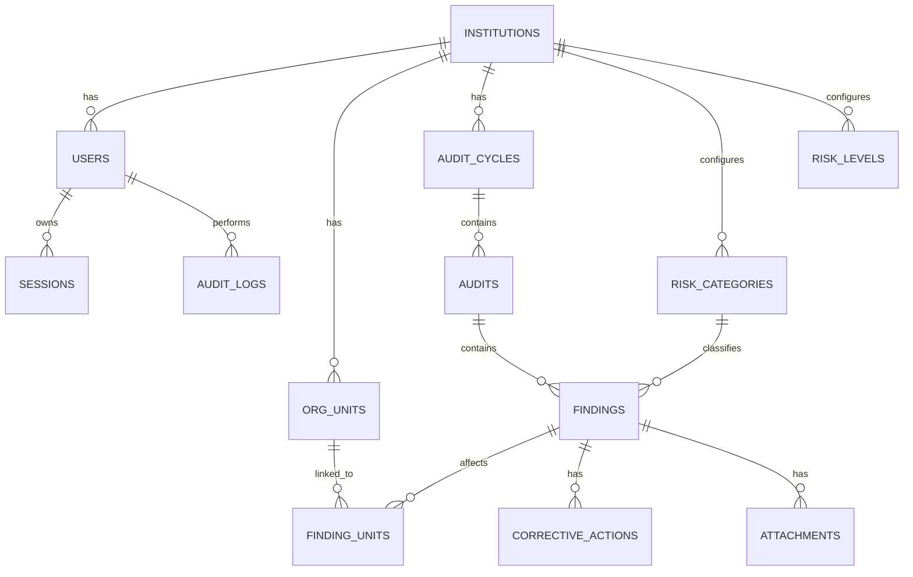
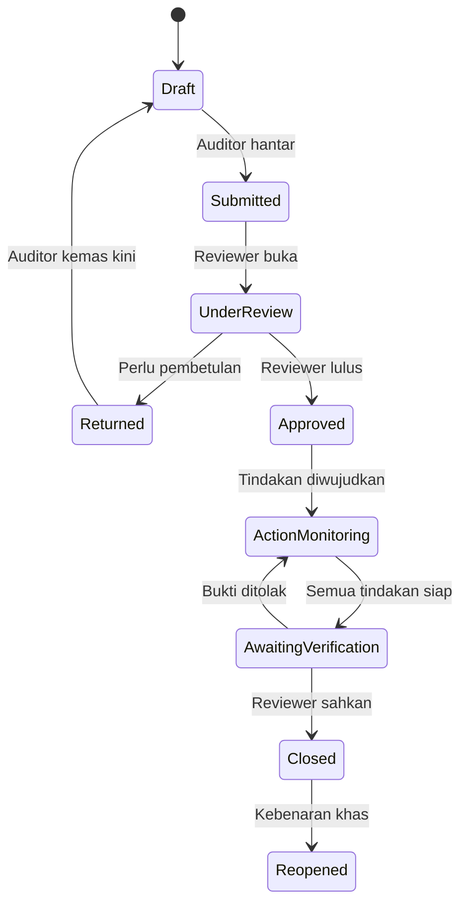

# Blueprint Sistem SPRAD V2

**Sistem Penilaian Risiko Audit Dalam (SPRAD)**
**Stack dikekalkan:** GitHub Pages + HTML/CSS/JavaScript vanilla + Google Apps Script + Google Sheets
**Tujuan dokumen:** spesifikasi struktur sistem, data, pengiraan risiko, aliran kerja, laporan, keselamatan, migrasi dan arahan implementasi untuk Codex.

---

## 1. Keputusan Reka Bentuk Utama

SPRAD V2 hendaklah dibina sebagai sistem berhierarki dan berbilang institusi, bukan lagi sebagai borang `contacts` umum.

Hierarki rasmi:

```text
SPRAD
└── Institusi / Universiti
    ├── Profil institusi
    ├── Pengguna dan peranan
    ├── PTJ / Jabatan / Unit
    ├── Kitaran audit
    │   └── Pengauditan / Audit engagement
    │       └── Penemuan / Isu audit
    │           ├── Kategori risiko
    │           ├── PTJ terlibat (satu atau lebih)
    │           ├── Kemungkinan (1-4)
    │           ├── Kesan (1-4)
    │           ├── Skor dan tahap risiko
    │           ├── Justifikasi dan bukti
    │           ├── Syor audit
    │           └── Tindakan pembetulan
    │               ├── Pemilik tindakan
    │               ├── Tarikh sasaran
    │               ├── Status dan kemajuan
    │               └── Bukti penyelesaian
    ├── Dashboard dan analitik
    ├── Laporan rasmi
    └── Log audit sistem
```

Prinsip utama:

1. Semua data perniagaan mesti mempunyai `institution_id`.
2. Pengiraan risiko rasmi ialah skala **1-4 x 1-4 = 1-16**.
3. Formula dikira semula di backend; frontend hanya untuk pratonton.
4. `Delete` bagi data audit ialah **soft delete/archive**, bukan padam fizikal biasa.
5. Semua perubahan penting direkod dalam `audit_logs`.
6. Peranan dan skop institusi disemak di backend, bukan hanya melalui paparan halaman.
7. Sistem kekal tanpa framework, tetapi JavaScript dipecahkan kepada ES modules.
8. Laporan perlu boleh menghasilkan struktur seperti contoh UniMAP: matriks, isu mengikut kategori, rumusan keseluruhan, rumusan kategori dan keutamaan tindakan.

---

## 2. Tree Chart Modul Sistem

```mermaid
flowchart TB
    SPRAD[SPRAD V2]

    SPRAD --> AUTH[Autentikasi & Akses]
    AUTH --> LOGIN[Log masuk / Log keluar]
    AUTH --> SESSION[Sesi & Tamat Tempoh]
    AUTH --> RBAC[Role & Institution Scope]

    SPRAD --> MASTER[Data Induk]
    MASTER --> INST[Institusi CRUD]
    INST --> PROFILE[Profil, logo & metadata laporan]
    INST --> UNIT[PTJ / Jabatan / Unit CRUD]
    INST --> USER[Pengguna CRUD]
    INST --> MATRIX[Skala & Matriks Risiko]
    INST --> CATEGORY[Kategori Risiko CRUD]

    SPRAD --> AUDIT[Pengurusan Audit]
    AUDIT --> CYCLE[Kitaran Audit CRUD]
    CYCLE --> ENGAGEMENT[Audit / Skop Audit CRUD]
    ENGAGEMENT --> FINDING[Penemuan / Isu Audit CRUD]
    FINDING --> SCORE[Pengiraan Risiko]
    FINDING --> REVIEW[Semakan & Kelulusan]
    FINDING --> EVIDENCE[Bukti / Lampiran]
    FINDING --> ACTION[Tindakan Pembetulan CRUD]

    SPRAD --> ANALYTICS[Dashboard & Analitik]
    ANALYTICS --> SUMMARY[Ringkasan Tahap Risiko]
    ANALYTICS --> FILTER[Filter Institusi, Tahun, PTJ, Kategori]
    ANALYTICS --> OVERDUE[Tindakan Lewat]

    SPRAD --> REPORT[Laporan]
    REPORT --> MATRIXPAGE[Matriks Risiko]
    REPORT --> CATEGORYPAGE[Isu Mengikut Kategori]
    REPORT --> OVERALLPAGE[Rumusan Keseluruhan]
    REPORT --> CATPAGE[Rumusan Mengikut Kategori]
    REPORT --> PRIORITYPAGE[Keutamaan Tindakan]
    REPORT --> PRINT[Cetak / Simpan PDF / CSV]

    SPRAD --> GOVERNANCE[Tadbir Urus]
    GOVERNANCE --> LOG[Audit Log]
    GOVERNANCE --> BACKUP[Backup Berkala]
    GOVERNANCE --> SETTINGS[Tetapan Sistem]
```



---

## 3. Hubungan Data Utama



Nota penting: `finding_units` diperlukan kerana satu isu boleh melibatkan lebih daripada satu PTJ, contohnya “FKTM dan PKU”.

---

## 4. Modul dan Fungsi

### 4.1 Autentikasi dan Peranan

Cadangan peranan:

| Peranan | Skop | Keupayaan utama |
|---|---|---|
| `super_admin` | Semua institusi | CRUD institusi, tetapan global, semua pengguna dan laporan |
| `institution_admin` | Institusi sendiri | CRUD PTJ, kitaran audit, pengguna institusi, kategori dan tetapan institusi |
| `auditor` | Institusi sendiri | Cipta/edit penemuan draf, lampiran, syor dan hantar untuk semakan |
| `reviewer` | Institusi sendiri | Semak, pulangkan, lulus, override tahap dengan sebab dan sahkan tindakan |
| `viewer` | Institusi sendiri | Lihat dashboard dan laporan tanpa hak ubah |

Migrasi peranan lama:

```text
pentadbir -> super_admin atau institution_admin
pengguna  -> auditor
```

Public registration untuk pentadbir mesti ditutup. Akaun baharu dicipta oleh pentadbir atau melalui jemputan terkawal.

### 4.2 Institusi / Universiti

CRUD institusi merangkumi:

- Kod institusi.
- Nama penuh dan nama ringkas.
- Kementerian/agensi.
- Alamat.
- Logo dan favicon.
- Tajuk laporan.
- Status aktif/tidak aktif.
- Tetapan matriks risiko.

Peraturan delete:

- Institusi yang mempunyai rekod tidak boleh dipadam fizikal.
- Gunakan `status=inactive` atau soft delete.
- Restore mesti tersedia.
- Hard delete hanya untuk `super_admin`, selepas semakan dependency dan pengesahan khas.

### 4.3 PTJ / Jabatan / Unit

- CRUD PTJ mengikut institusi.
- Sokong struktur parent-child melalui `parent_unit_id`.
- Contoh jenis: Fakulti, Jabatan, Pusat, Unit, Kampus.
- Satu finding boleh dipautkan kepada satu atau beberapa PTJ.

### 4.4 Kitaran Audit dan Audit Engagement

`audit_cycles` mewakili tahun/tempoh laporan, contohnya `Audit Dalam 2025`.

`audits` mewakili skop atau tugasan audit dalam kitaran tersebut, contohnya:

- Audit Pengurusan Kewangan FKTM.
- Audit Pengurusan Kenderaan.
- Audit Perpustakaan.

Apabila kitaran ditutup/finalized:

- Penemuan dan keputusan risiko menjadi read-only.
- Pembukaan semula memerlukan `reviewer` atau `institution_admin` dan mesti direkod dalam audit log.

### 4.5 Penemuan / Isu Audit

Medan minimum:

- Nombor penemuan.
- Institusi.
- Kitaran audit dan audit engagement.
- Satu atau lebih PTJ.
- Kategori risiko.
- Tajuk isu.
- Huraian isu audit.
- Justifikasi terperinci.
- Punca utama.
- Kesan/implikasi.
- Bukti audit atau pautan dokumen.
- Syor audit.
- Kemungkinan 1-4.
- Kesan 1-4.
- Skor risiko.
- Tahap dikira.
- Tahap akhir.
- Sebab override, jika ada.
- Status workflow.
- Catatan semakan.

### 4.6 Tindakan Pembetulan

Satu finding boleh mempunyai beberapa tindakan.

Medan:

- Tindakan dicadangkan/dipersetujui.
- Pemilik tindakan.
- PTJ pemilik.
- Tarikh sasaran.
- Status.
- Peratus kemajuan.
- Catatan kemajuan.
- Bukti penyelesaian.
- Penyemak dan tarikh pengesahan.

Status tindakan:

```text
open -> in_progress -> awaiting_verification -> verified -> closed
                              \-> rejected / reopened
```

Status `overdue` dikira secara dinamik apabila tarikh sasaran telah lepas dan tindakan belum `verified` atau `closed`.

---

## 5. Enjin Pengiraan Risiko

### 5.1 Formula Rasmi

```text
risk_score = likelihood * impact
```

Kedua-duanya hanya menerima integer 1 hingga 4.

### 5.2 Klasifikasi Default

| Skor | Tahap | Rank |
|---:|---|---:|
| 1-4 | Rendah | 1 |
| 5-8 | Sederhana | 2 |
| 9-12 | Tinggi | 3 |
| 13-16 | Kritikal | 4 |

Nilai ini hendaklah disimpan dalam `risk_levels`, bukan di-hardcode pada banyak fail.

### 5.3 Pengiraan Wajib di Backend

Frontend boleh memaparkan pratonton, tetapi Apps Script mesti mengira semula:

```javascript
score = likelihood * impact;
calculatedLevel = findRiskLevel(score);
```

Backend tidak boleh mempercayai `risk_score` atau `risk_level` yang dihantar oleh browser.

### 5.4 Pertimbangan Profesional Audit

Contoh UniMAP menyatakan tahap turut mengambil kira pertimbangan profesional audit. Oleh itu simpan dua nilai:

- `calculated_level_id`: hasil formula.
- `final_level_id`: tahap rasmi selepas semakan.

Jika `final_level_id` berbeza daripada tahap dikira:

- Hanya `reviewer` atau pentadbir dibenarkan.
- `override_reason` wajib.
- `reviewed_by` dan `reviewed_at` wajib.
- Perubahan direkod dalam `audit_logs`.

### 5.5 Rumusan Mengikut Kategori

Bagi setiap kategori:

- `issue_count` = bilangan finding aktif.
- `% jumlah` = issue_count / jumlah keseluruhan x 100.
- Agihan tahap = peratus setiap tahap.
- `category_level` = **tahap tertinggi** yang wujud dalam kategori.

Kaedah tahap tertinggi ini sepadan dengan contoh kategori yang diberi tahap Kritikal walaupun majoriti isunya berada pada tahap Tinggi.

### 5.6 Rumusan Keseluruhan

Paparkan:

- Bilangan dan peratus Kritikal, Tinggi, Sederhana, Rendah.
- Peratus `Tinggi + Kritikal`.
- Purata skor sebagai analitik tambahan, bukan pengganti tahap rasmi.
- Tahap keseluruhan default = tahap yang paling banyak bilangannya (`mode`); jika seri, pilih tahap yang lebih tinggi.

Kaedah ini menjelaskan contoh keseluruhan `TINGGI` apabila Tinggi ialah kumpulan terbesar, walaupun terdapat isu Kritikal.

Sediakan tetapan `overall_level_method` supaya institusi boleh menukar kaedah pada masa depan tanpa mengubah kod.

### 5.7 SLA Tindakan Default

| Tahap | Sasaran default |
|---|---|
| Kritikal | Segera / 7 hari |
| Tinggi | 30 hari |
| Sederhana | 90 hari |
| Rendah | 180 hari / tindakan rutin |

Nilai SLA disimpan dalam `risk_levels.default_due_days` dan boleh diubah oleh institusi.

---

## 6. Struktur Google Sheets

Gunakan satu spreadsheet pangkalan data dengan sheet berikut. Semua timestamp disimpan dalam format ISO 8601.

### 6.1 `settings`

```text
scope_type, scope_id, key, value, updated_at, updated_by
```

Contoh key:

```text
schema_version
app_name
allow_public_registration
overall_level_method
session_ttl_minutes
report_footer
```

### 6.2 `institutions`

```text
id, code, name, short_name, ministry, address, logo_url, report_title,
status, created_at, created_by, updated_at, updated_by,
deleted_at, deleted_by
```

### 6.3 `org_units`

```text
id, institution_id, code, name, unit_type, parent_unit_id, status,
created_at, created_by, updated_at, updated_by, deleted_at, deleted_by
```

### 6.4 `users`

```text
id, institution_id, username, display_name, email,
password_hash, password_salt, role, status,
failed_login_count, locked_until,
created_at, created_by, updated_at, updated_by,
deactivated_at, deactivated_by
```

### 6.5 `sessions`

```text
token_hash, user_id, institution_id, role,
expires_at, last_seen_at, revoked_at, created_at
```

Simpan hash token sahaja di sheet. Token mentah hanya diberi kepada client semasa login.

### 6.6 `audit_cycles`

```text
id, institution_id, title, audit_year, start_date, end_date,
status, report_reference, finalized_at, finalized_by,
created_at, created_by, updated_at, updated_by, deleted_at, deleted_by
```

### 6.7 `audits`

```text
id, institution_id, cycle_id, audit_code, title, scope, objective,
lead_auditor_user_id, start_date, end_date, status,
created_at, created_by, updated_at, updated_by, deleted_at, deleted_by
```

### 6.8 `risk_categories`

Seed default berdasarkan contoh:

1. Tiada Mandat.
2. Kesilapan Isu Teknikal.
3. Kecuaian.
4. Pembaziran.
5. Penyelewengan / Ketirisan.

Columns:

```text
id, institution_id, code, name, description, sort_order, status,
created_at, created_by, updated_at, updated_by, deleted_at, deleted_by
```

### 6.9 `likelihood_scale`

```text
institution_id, value, label, guidance, sort_order, status
```

Default:

```text
1 Rendah
2 Sederhana
3 Tinggi
4 Sangat Tinggi
```

### 6.10 `impact_scale`

```text
institution_id, value, label, guidance, sort_order, status
```

Default:

```text
1 Rendah
2 Sederhana
3 Tinggi
4 Sangat Tinggi
```

### 6.11 `risk_levels`

```text
id, institution_id, code, label, rank, min_score, max_score,
color_hex, description, default_due_days, status
```

### 6.12 `findings`

```text
id, institution_id, cycle_id, audit_id, category_id, finding_no,
title, issue_description, detailed_justification, root_cause,
impact_description, audit_evidence, recommendation,
likelihood, impact, calculated_score, calculated_level_id,
final_level_id, override_reason,
workflow_status, review_note,
created_at, created_by, updated_at, updated_by,
submitted_at, submitted_by, reviewed_at, reviewed_by,
approved_at, approved_by,
deleted_at, deleted_by, row_version
```

### 6.13 `finding_units`

```text
id, institution_id, finding_id, unit_id, created_at, created_by
```

### 6.14 `corrective_actions`

```text
id, institution_id, finding_id, action_text,
owner_user_id, owner_name, owner_unit_id,
target_date, status, progress_percent, progress_note,
completion_evidence, submitted_for_verification_at,
verified_at, verified_by, verification_note,
created_at, created_by, updated_at, updated_by,
deleted_at, deleted_by, row_version
```

### 6.15 `attachments`

```text
id, institution_id, entity_type, entity_id,
drive_file_id, file_name, mime_type, file_url,
uploaded_at, uploaded_by, deleted_at, deleted_by
```

Fasa awal boleh menyimpan URL Google Drive sahaja. Upload fail sebenar boleh ditambah kemudian.

### 6.16 `audit_logs`

```text
id, institution_id, user_id, action,
entity_type, entity_id, request_id,
before_json, after_json, created_at
```

Jangan simpan kata laluan, token mentah atau data rahsia dalam `before_json`/`after_json`.

### 6.17 `mutation_receipts`

```text
request_id, user_id, institution_id, action,
entity_type, entity_id, status, error_code, error_message,
created_at, completed_at
```

Sheet ini menyelesaikan masalah POST `mode: no-cors` dengan menyediakan pengesahan operasi melalui polling GET.

---

## 7. Strategi API Google Apps Script

### 7.1 Struktur Respons Baca

```json
{
  "ok": true,
  "data": {},
  "error": null,
  "meta": {
    "requestId": "uuid",
    "timestamp": "2026-06-19T12:00:00.000Z"
  }
}
```

Respons gagal:

```json
{
  "ok": false,
  "data": null,
  "error": {
    "code": "VALIDATION_ERROR",
    "message": "Kemungkinan mesti antara 1 hingga 4",
    "fields": {
      "likelihood": "OUT_OF_RANGE"
    }
  },
  "meta": {}
}
```

### 7.2 GET Actions

```text
auth.me
auth.logout
config.get
institutions.list
institutions.get
orgUnits.list
users.list
auditCycles.list
audits.list
riskCategories.list
riskMatrix.get
findings.list
findings.get
correctiveActions.list
dashboard.summary
reports.dataset
mutations.status
```

### 7.3 POST Mutation Actions

```text
auth.login
institutions.create
institutions.update
institutions.delete
institutions.restore
orgUnits.create
orgUnits.update
orgUnits.delete
auditCycles.create
auditCycles.update
auditCycles.finalize
audits.create
audits.update
findings.create
findings.update
findings.delete
findings.restore
findings.submit
findings.return
findings.approve
findings.overrideLevel
correctiveActions.create
correctiveActions.update
correctiveActions.submitForVerification
correctiveActions.verify
users.create
users.update
users.deactivate
settings.update
```

### 7.4 Penyelesaian POST `no-cors`

Oleh sebab browser tidak boleh membaca respons POST opaque:

1. Client jana `requestId` UUID.
2. Client hantar POST dengan `requestId` dan `action`.
3. Backend gunakan `LockService`.
4. Backend semak sama ada `requestId` pernah diproses.
5. Backend jalankan mutation sekali sahaja.
6. Backend tulis hasil ke `mutation_receipts`.
7. Client polling:

```text
GET action=mutations.status&requestId=...&token=...
```

8. UI hanya memaparkan “berjaya” apabila receipt berstatus `success`.
9. Timeout mesti memaparkan “status belum dapat disahkan”, bukan kejayaan palsu.

Ini juga memberi idempotency dan mengelakkan rekod berganda apabila pengguna menekan submit berulang kali.

### 7.5 Peraturan Backend Wajib

- Setiap action mempunyai validation schema.
- Setiap mutation mengesahkan session, role dan institution scope.
- `institution_id` diambil daripada session bagi role institusi; jangan percaya nilai client.
- Gunakan `LockService` pada write.
- Gunakan header map; jangan bergantung kepada nombor kolum tetap.
- Gunakan `row_version` untuk elak overwrite perubahan serentak.
- Semua create/update/delete/approve/verify menulis audit log.
- Risk score sentiasa dikira semula di backend.
- Filter semua bacaan mengikut `institution_id` sebelum dihantar ke client.

---

## 8. Struktur Kod Frontend

Kekalkan multi-page app supaya migrasi daripada sistem semasa lebih selamat.

```text
/
├── index.html
├── login.html
├── dashboard.html
├── institutions.html
├── institution-form.html
├── org-units.html
├── users.html
├── audit-cycles.html
├── audits.html
├── findings.html
├── finding-form.html
├── finding-view.html
├── actions.html
├── reports.html
├── report-print.html
├── settings.html
├── 404.html
├── assets/
│   ├── css/
│   │   ├── tokens.css
│   │   ├── base.css
│   │   ├── layout.css
│   │   ├── components.css
│   │   ├── utilities.css
│   │   ├── pages.css
│   │   └── print.css
│   └── js/
│       ├── config.js
│       ├── core/
│       │   ├── api.js
│       │   ├── auth.js
│       │   ├── permissions.js
│       │   ├── storage.js
│       │   ├── validators.js
│       │   ├── formatters.js
│       │   ├── dom.js
│       │   ├── toast.js
│       │   ├── modal.js
│       │   ├── table.js
│       │   └── mutation.js
│       ├── services/
│       │   ├── institution-service.js
│       │   ├── org-unit-service.js
│       │   ├── user-service.js
│       │   ├── audit-service.js
│       │   ├── finding-service.js
│       │   ├── action-service.js
│       │   ├── dashboard-service.js
│       │   └── report-service.js
│       ├── components/
│       │   ├── app-shell.js
│       │   ├── data-table.js
│       │   ├── confirm-dialog.js
│       │   ├── risk-badge.js
│       │   ├── risk-matrix.js
│       │   └── filters.js
│       └── pages/
│           ├── login-page.js
│           ├── dashboard-page.js
│           ├── institutions-page.js
│           ├── org-units-page.js
│           ├── users-page.js
│           ├── audit-cycles-page.js
│           ├── audits-page.js
│           ├── findings-page.js
│           ├── finding-form-page.js
│           ├── finding-view-page.js
│           ├── actions-page.js
│           ├── reports-page.js
│           └── report-print-page.js
└── docs/
    ├── SPRAD_V2_SYSTEM_BLUEPRINT.md
    ├── API_CONTRACT.md
    ├── DATA_SCHEMA.md
    ├── DEPLOYMENT.md
    └── MANUAL_TEST_CHECKLIST.md
```

Peraturan frontend:

- Gunakan `<script type="module">`.
- Semua URL API hanya dalam `config.js`.
- Jangan simpan password dalam localStorage.
- “Ingat saya” hanya menyimpan username.
- Render data pengguna dengan `textContent`, bukan `innerHTML` mentah.
- Semua halaman guna guard `auth.requireRole(...)`.
- Backend tetap menjadi sumber kebenaran bagi permission.
- Cache mesti mempunyai key berdasarkan `user_id`, `institution_id` dan resource.
- Cache dibersihkan ketika logout, perubahan institusi atau perubahan role.

---

## 9. Struktur Kod Apps Script

```text
apps-script/
├── Code.gs
├── Config.gs
├── Router.gs
├── Response.gs
├── AuthService.gs
├── PermissionService.gs
├── Validation.gs
├── SheetRepository.gs
├── InstitutionService.gs
├── OrgUnitService.gs
├── UserService.gs
├── AuditCycleService.gs
├── AuditService.gs
├── FindingService.gs
├── CorrectiveActionService.gs
├── RiskEngine.gs
├── DashboardService.gs
├── ReportService.gs
├── MutationService.gs
├── AuditLogService.gs
├── Setup.gs
├── Migration.gs
├── Backup.gs
├── Tests.gs
└── appsscript.json
```

Tanggungjawab:

- `Router.gs`: petakan action kepada handler.
- `AuthService.gs`: login, session, logout, rate limit.
- `PermissionService.gs`: role dan institution scope.
- `SheetRepository.gs`: operasi sheet generik berdasarkan header.
- `RiskEngine.gs`: formula, klasifikasi dan rumusan.
- `MutationService.gs`: idempotency dan receipt.
- `AuditLogService.gs`: before/after log tersanitasi.
- `Setup.gs`: cipta sheet/header dan seed default secara idempotent.
- `Migration.gs`: migrasi schema lama.
- `Backup.gs`: time-based trigger untuk backup.

---

## 10. Aliran Workflow Penemuan



Peraturan edit:

- Auditor boleh edit `Draft` dan `Returned` sahaja.
- Reviewer boleh edit bahagian semakan, final level dan approval.
- Finding `Approved` tidak boleh diubah pada kandungan utama tanpa reopen.
- Finding `Closed` read-only kecuali reopen dengan audit log.

---

## 11. Dashboard

### 11.1 Kad Ringkasan

- Jumlah isu.
- Kritikal.
- Tinggi.
- Sederhana.
- Rendah.
- Tinggi + Kritikal (%).
- Belum disemak.
- Tindakan lewat.
- Tindakan menunggu verifikasi.

### 11.2 Filter

- Institusi, untuk super admin.
- Tahun/kitaran audit.
- Audit engagement.
- PTJ.
- Kategori.
- Tahap risiko.
- Workflow status.
- Status tindakan.
- Julat tarikh.
- Carian teks.

### 11.3 Visual

- Agihan tahap risiko.
- Isu mengikut kategori.
- Isu mengikut PTJ.
- Trend bulanan.
- Tindakan mengikut status.
- Senarai risiko Kritikal/Tinggi tertua.
- Senarai tindakan overdue.

Untuk mengekalkan sistem tanpa framework dan dependency minimum, chart boleh dibina menggunakan SVG vanilla. Jika library dibenarkan, pilih satu library kecil dan pusatkan penggunaannya; jangan campur beberapa library.

---

## 12. Laporan Seperti Contoh UniMAP

`report-print.html` perlu menghasilkan halaman cetak dengan `@media print` dan page break tetap.

Susunan laporan:

1. **Muka hadapan**
   - Logo institusi.
   - Nama institusi.
   - Tajuk analisis.
   - Tahun/kitaran audit.
   - Unit penyedia.

2. **Matriks Pemarkahan Risiko**
   - Grid 4 x 4.
   - Formula.
   - Julat tahap dan panduan klasifikasi.

3. **Isu Audit Mengikut Kategori**
   - Kategori dan penerangan.
   - Bilangan.
   - PTJ terlibat.
   - Isu audit.
   - Skor `KxI`.
   - Tahap risiko.
   - Justifikasi terperinci.
   - Auto pagination 2-3 isu setiap halaman bergantung panjang teks.

4. **Rumusan Keseluruhan Risiko**
   - Bilangan dan peratus setiap tahap.
   - Tahap keseluruhan.
   - Peratus Tinggi/Kritikal.
   - Rumusan pengurusan.
   - Implikasi utama.

5. **Rumusan Mengikut Kategori**
   - Bilangan isu.
   - Peratus jumlah.
   - Agihan tahap.
   - Tahap kategori.

6. **Keutamaan Tindakan Pengurusan**
   - Segera.
   - Dalam 30 hari.
   - Dalam 90 hari.
   - Tindakan rutin/berjadual jika diperlukan.

7. **Lampiran pilihan**
   - Daftar tindakan.
   - Status kemajuan.
   - Bukti/pautan.

Output:

- Print browser ke PDF.
- CSV untuk jadual mentah.
- Laporan hanya menggunakan finding `Approved` secara default.
- Paparkan watermark “DRAF” jika kitaran belum finalized.

---

## 13. Keselamatan dan Integriti

Keutamaan wajib:

1. Tutup public admin registration.
2. Jangan simpan password dalam browser storage.
3. Guna salt per pengguna dan pepper dalam `PropertiesService`.
4. Simpan hash token sesi, bukan token mentah.
5. Session mempunyai expiry dan revoke.
6. Rate limit login dan mutation.
7. Sanitize output dan elakkan `innerHTML` untuk data pengguna.
8. Validate semua input di backend.
9. Role dan tenant isolation di backend.
10. LockService pada setiap write.
11. Soft delete + restore.
12. Audit log untuk perubahan penting.
13. Backup spreadsheet harian atau mingguan ke fail salinan bertarikh.
14. Jangan expose Spreadsheet ID, pepper atau secret pada frontend.
15. Tambah `<meta name="referrer" content="no-referrer">` bagi mengurangkan kebocoran URL API/token.

Had stack perlu direkod dengan jujur: Google Sheets dan Apps Script sesuai untuk sistem kecil/sederhana, tetapi bukan pengganti pangkalan data transaksi berskala besar.

---

## 14. Migrasi Daripada Sistem Semasa

### 14.1 Prinsip

- Backup spreadsheet dan repo dahulu.
- Migration mesti idempotent.
- Jangan padam sheet lama secara automatik.
- Simpan `schema_version`.

### 14.2 Data Lama

- `users`: migrasi role dan tambah institution default.
- `sessions`: invalidate selepas deployment V2.
- `contacts`: pindah ke `legacy_contacts` atau import sebagai finding berstatus `legacy_incomplete`.
- Jangan menukar `message` lama terus menjadi penemuan approved kerana data tidak mencukupi.

### 14.3 Urutan Migrasi

```text
1. Backup
2. Cipta schema V2
3. Seed risk matrix dan kategori
4. Cipta institusi default
5. Migrasi users
6. Migrasi contacts ke legacy
7. Deploy backend baharu
8. Deploy frontend baharu
9. Smoke test
10. Tutup pendaftaran admin awam
```

---

## 15. Fasa Implementasi Disyorkan

### Fasa 0 - Baseline dan Backup

- Audit repo semasa.
- Simpan snapshot Google Sheets.
- Dokumentasi action API sedia ada.
- Tambah smoke test minimum.

### Fasa 1 - Foundation

- Refactor JS berulang kepada modules.
- Pusatkan config/API URL.
- Backend router, response envelope, repository dan validation.
- Setup/migration idempotent.
- Perbaiki session dan matikan public admin registration.

### Fasa 2 - Institusi dan Data Induk

- CRUD institutions.
- CRUD org units.
- CRUD users dengan role baru.
- CRUD categories dan risk matrix.
- Institution isolation.

### Fasa 3 - Audit dan Penemuan

- CRUD audit cycles.
- CRUD audits.
- CRUD findings.
- Many-to-many PTJ.
- RiskEngine 1-4 x 1-4.
- Soft delete, restore dan audit log.

### Fasa 4 - Review dan Tindakan

- Submit/return/approve workflow.
- Professional override dengan sebab.
- Corrective actions.
- Due date, overdue dan verification.

### Fasa 5 - Dashboard dan Laporan

- Summary cards dan filters.
- Visual analitik.
- Report print berstruktur seperti UniMAP.
- Export CSV.

### Fasa 6 - Hardening

- Rate limit.
- Salt + pepper.
- Backup trigger.
- CacheService.
- Performance profiling.
- Ujian permission/tenant isolation.
- Dokumentasi deployment dan recovery.

Jangan serahkan satu perubahan besar tanpa checkpoint. Setiap fasa mesti meninggalkan sistem yang boleh digunakan dan diuji.

---

## 16. Acceptance Criteria Utama

1. Super admin boleh create, view, edit, archive dan restore institusi.
2. Pengguna institusi tidak boleh membaca atau mengubah data institusi lain, walaupun mengubah request secara manual.
3. Institution admin boleh urus PTJ, pengguna, kategori, matriks dan kitaran audit institusinya.
4. Auditor boleh create/edit/delete secara soft penemuan dalam status yang dibenarkan.
5. Satu finding boleh melibatkan beberapa PTJ.
6. Likelihood dan impact hanya menerima 1-4.
7. Backend mengira skor dan tahap semula.
8. Skor 1-4 Rendah, 5-8 Sederhana, 9-12 Tinggi, 13-16 Kritikal.
9. Reviewer boleh override tahap hanya dengan sebab wajib.
10. Semua perubahan create/update/delete/approve/verify mempunyai audit log.
11. POST tidak memaparkan kejayaan sebelum mutation receipt disahkan.
12. Duplicate submit dengan `requestId` sama tidak mencipta rekod kedua.
13. Dashboard boleh filter mengikut institusi/tahun/PTJ/kategori/tahap/status.
14. Laporan mempunyai matriks, kategori, rumusan keseluruhan, rumusan kategori dan keutamaan tindakan.
15. Category level menggunakan tahap tertinggi dalam kategori.
16. Overall level menggunakan kaedah konfigurasi; default ialah mode dengan tie-break tahap lebih tinggi.
17. Kitaran finalized adalah read-only.
18. Delete biasa tidak memadam rekod audit secara fizikal.
19. Password tidak disimpan dalam localStorage.
20. Tiada error console kritikal dan UI responsive pada mobile/desktop.

---

## 17. Ujian Kritikal

### Risk Engine

```text
K1 x I1 = 1  -> Rendah
K2 x I2 = 4  -> Rendah
K1 x I5      -> ditolak
K2 x I3 = 6  -> Sederhana
K3 x I3 = 9  -> Tinggi
K4 x I4 = 16 -> Kritikal
```

### Tenant Isolation

- User Institusi A tidak boleh get finding Institusi B menggunakan ID terus.
- Institution admin A tidak boleh create PTJ untuk B.
- Cache data A tidak muncul selepas login sebagai user B.

### Workflow

- Auditor tidak boleh approve.
- Reviewer tidak boleh override tanpa sebab.
- Approved finding tidak boleh diedit auditor.
- Finalized cycle tidak boleh menerima finding baharu.

### Mutation

- Request ID sama diproses sekali.
- Poll receipt berjaya memaparkan status sebenar.
- Timeout tidak memaparkan false success.

### Audit Trail

- Create, update, soft delete, restore, approve, override dan verify direkod.
- Log tidak mengandungi password/token mentah.

---

## 18. Prompt Induk Untuk Codex

Salin prompt ini selepas blueprint dimasukkan ke dalam repo sebagai `docs/SPRAD_V2_SYSTEM_BLUEPRINT.md`.

```text
Spawn exactly one `coder` subagent to improve the existing SPRAD repository directly.

Read these files first:
- all applicable AGENTS.md files
- docs/SPRAD_V2_SYSTEM_BLUEPRINT.md
- SPRAD_SYSTEM_REVIEW.md
- the current frontend files
- the current Google Apps Script backend files
- existing tests and deployment notes

Context:
SPRAD already exists. It uses GitHub Pages, vanilla HTML/CSS/JavaScript, Google Apps Script as the API, and Google Sheets as the database. Do not replace this stack and do not introduce a frontend framework.

Primary goal:
Evolve the current contact-form prototype into a structured multi-institution internal audit risk assessment system. The top-level business entity is Institution/University. Each institution contains users, PTJ/org units, audit cycles, audits, findings, risk calculations, corrective actions, dashboards, reports, and audit logs.

Authoritative specification:
Use docs/SPRAD_V2_SYSTEM_BLUEPRINT.md as the target architecture and acceptance criteria. When the existing implementation conflicts with the blueprint, preserve user data and migrate safely rather than deleting or blindly replacing it.

Mandatory rules:
- Inspect git status and the complete current diff before editing.
- Preserve unrelated changes.
- Back up or preserve compatibility with the existing Sheets schema.
- Keep the application framework-free.
- Use vanilla ES modules and modular Apps Script .gs files.
- Centralize configuration and the Apps Script URL.
- Enforce permissions and institution isolation in the backend.
- Use a 1-4 likelihood and 1-4 impact matrix, producing scores 1-16.
- The backend must recalculate risk scores and levels.
- Use soft delete and audit logs for business records.
- Use LockService for writes.
- Implement idempotent mutations using requestId and mutation receipts because the existing frontend uses POST mode:no-cors.
- Never report a mutation as successful until its receipt is confirmed.
- Do not store passwords in localStorage.
- Disable public administrator registration.
- Do not add production dependencies unless strictly necessary.
- Do not perform a destructive migration.

Implementation approach:
Work phase by phase. At the start, inspect the repository and determine which blueprint phase is currently safe to implement. Implement the largest coherent phase that can be completed and validated without leaving the app broken. Prefer completing Foundation plus Institution/Data Master before starting broad dashboard polish.

Required first milestone:
1. Add/update documentation and schema versioning.
2. Create idempotent Apps Script setup/migration utilities.
3. Introduce the backend router, response helpers, validation, permissions, repository abstraction, RiskEngine, MutationService, and AuditLogService.
4. Centralize frontend config, API, auth, mutation polling, validation, toast, modal, and table helpers.
5. Implement Institution CRUD with soft delete/restore.
6. Enforce role and institution scope in backend handlers.
7. Add tests for risk calculations, permissions, institution isolation, and duplicate requestId handling.
8. Keep current login and legacy data usable during migration.

Risk rules:
- score = likelihood * impact
- 1-4: Rendah
- 5-8: Sederhana
- 9-12: Tinggi
- 13-16: Kritikal
- Store calculated level separately from final reviewed level.
- A reviewer override requires a reason and audit log.

Validation:
Run all relevant tests, lint/type checks if present, and build/static validation. If the repo has no test setup, add lightweight test runners appropriate for vanilla JavaScript and Apps Script without introducing a heavy framework. Perform focused manual smoke checks for login, route guards, CRUD, risk calculation, soft delete, restore, tenant isolation, and mutation receipt polling.

Before finishing:
- Review the full diff.
- Confirm no secrets, debug code, duplicate config, or unrelated formatting changes.
- List exact files changed.
- List exact validation commands run and their results.
- Separate pre-existing failures from failures introduced by the patch.
- State the next safe blueprint phase, but do not claim unimplemented features are complete.

Return format:
## Outcome
## Architecture Decisions Applied
## Files Changed
## Data Migration
## Validation
## Security and Compatibility
## Remaining Blueprint Phases
```

---

## 19. Keutamaan Praktikal

Urutan paling selamat dan paling bernilai:

```text
1. Foundation, auth, config dan migration
2. Institution CRUD dan tenant isolation
3. PTJ, audit cycle dan audit CRUD
4. Finding CRUD + RiskEngine
5. Review, override dan corrective actions
6. Dashboard
7. Report seperti UniMAP
8. Hardening, backup dan performance
```

Jangan mulakan dengan chart atau visual laporan sebelum data model, permission dan RiskEngine stabil.
